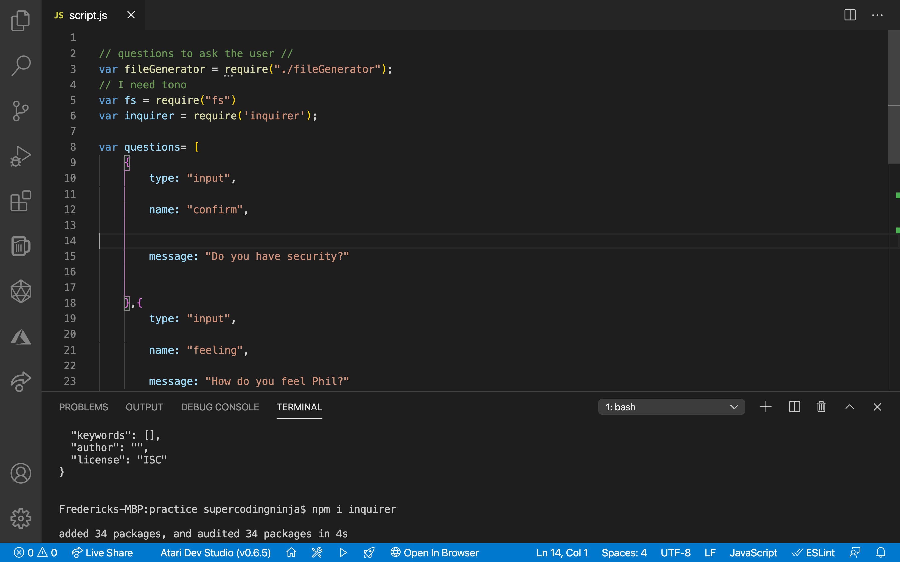
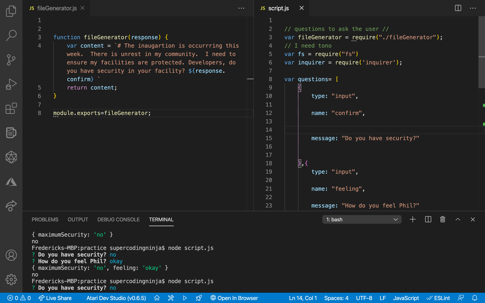
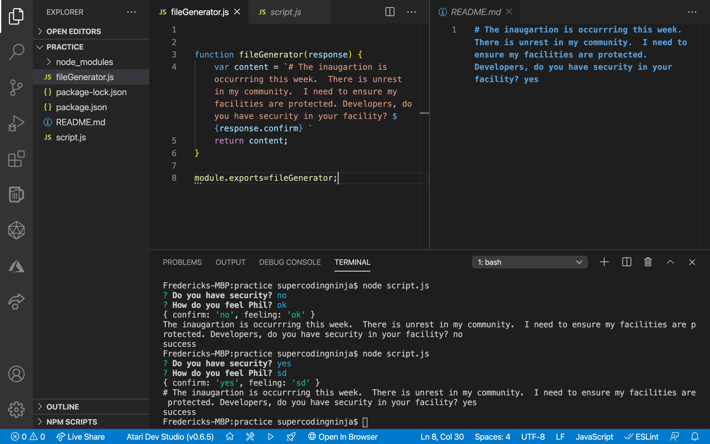

# Creating A Good ReadMe.md Generator
#####  [SuperCodingNinja](https://github.com/supercodingninja) •  [Email Me](mailto:SuperCodingNinja@outlook.com) •  [Video Tutorial](https://www.youtube.com/watch?v=Pp9IG-prQjE)
#### ReadMeGenerator© 2020 All Rights Reserved.  MIT All material must be cited or credited, when using material (free to use).

## Table of Contents
* [Repository Description](#Repository-Description)
* [Installation Instructions](#Install)
* [Usage Information](#Usage)
*[References](#Ref)
* [Repositiory End-Goal Criterea](#Criterea)
* [Future Project](#Future-Project)

# Repository Description
###### [Back to Table of Contents](#Table-of-Contents)
We live in a busy world; and thriving businesses are busier.  As a developer, you want a ReadMe generator: this enables you to quickly create a professional README for a new project.  This may even be the difference between staying on task(s), maintaining a job; or even eceiving a promotion (because you are ahead of the team).

Remember this also, as a developer, your goal should be designing NEW experiences that makes people's lives simple; because as developers, we solve problems that people didn't even knew they had- even better, in a way that they do not understand: We are the super heroes and heriones of tomorrow; so get coding, and I hope this repository helps you along your development. - [Frederick Thomas](https://www.linkedin.com/in/discoverfrederickthomas/), Super Coding Ninja™

## User Story
### As the Quiz Administrator
###### [Back to Table of Contents](#Table-of-Contents)
1.   I a command-line application that accepts user input.
2.   I want to be prompted for information about my application repository.
3.   I want a high-quality, professional README.md is generated with the title of my project and sections entitled Description, Table of Contents, Installation, Usage, License, Contribution Guidelines, Tests Instructions, and Questions.
4.   I want my project title to display as the title of the README.
5.   I want a description, installation instructions, usage information, contribution guidelines, and test instructions; and then, this information is added to the sections of the README entitled Description, Installation, Usage, Contribution Guidelines, and Tests Instructions.
6.   I want to choose a license for my application from a list of options; and then a badge for that license is added near the top of the README and a notice is added to the section of the README entitled License that explains which license the application is covered under.  
7.   I want to enter my GitHub username; ant then this is added to the section of the README entitled Questions, with a link to my GitHub profile.
8.   I want to enter my email address; and then this is added to the section of the README entitled Questions, with instructions on how to reach me with additional questions.
9.   I want to click on the links in the Table of Contents; and then, I am taken to the corresponding section of the README.

### Contribution Guidelines
###### [Back to Table of Contents](#Table-of-Contents)
I hope you enjoy this repository, and the application's link, given above and below (I love developing new projects).  Please feel free to fork and even collaborate with me on this awesome repository!  Thank you for viewing! - Frederick Thomas, [Super Coding Ninja™](https://github.com/supercodingninja).

## Test Instructions
###### [Back to Table of Contents](#Table-of-Contents)
1.  Ensure that your application includes the require dependacies, by typing the commnd in your integrated terminal "npm install inquirer".
2.  Create a .gitignore file and include node_modules/ and .DS_Store/ so that your node_modules directory isn't tracked or uploaded to GitHub.
3.  Run “node [fileName].js”

## Overview: What We Accomplished!
### Workflow [Back to Table of Contents](#Table-of-Contents)
Created an awesome and generic ReadMe.md file; which can be utilize for future endeavors!  I hope you enjoy this repository, and the application's link, given above and below (I love developing new projects).  Please feel free to fork and even collaborate with me on this awesome repository!  Thank you for viewing! - Frederick Thomas, [Super Coding Ninja™](https://github.com/supercodingninja)

### Screenshots (Building this application)
###### [Back to Table of Contents](#Table-of-Contents)
#### Demo I createad 

#### Demo I createad 

#### Demo I createad 

## References
###### [Back to Table of Contents](#Table-of-Contents)
1.  NPMjs](https://www.npmjs.com/package/inquirer) provides Documentation, Installation, Examples, Methods, Objects, Questions, Answers, Separator, Prompt Types, User Interfaces and Layouts, Reactive Interface, Support, Known issues, News, Contributing, License, and Plugins.  This was the core of this project; so be sure to view this resource, for your own future developments.

2.  [Shields IO](https://shields.io/) provides documentations on how to add your shield, for creditbility.  Please feel free to view this resource, for your future developments.

## Repositiory End-Goal Criterea
###### [Back to Table of Contents](#Table-of-Contents)
Stay on task, Get Ahead, Change The World!

## License
MIT

Please feel free to fork and even collaborate with me on this awesome [repository](https://github.com/supercodingninja/CodeQuiz ).  Thank you for viewing! - Frederick Thomas, Super Coding Ninja™ [2014-Present](https://supercodingninja.github.io/) All Rights Reserved

Permission is hereby granted, free of charge, to any person obtaining a copy of this software and associated documentation files (the "Software"), to deal in the Software without restriction, including without limitation the rights to use, copy, modify, merge, publish, distribute, sublicense, and/or sell copies of the Software, and to permit persons to whom the Software is furnished to do so, subject to the following conditions:

The above copyright notice and this permission notice shall be included in all copies or substantial portions of the Software.

THE SOFTWARE IS PROVIDED "AS IS", WITHOUT WARRANTY OF ANY KIND, EXPRESS OR IMPLIED, INCLUDING BUT NOT LIMITED TO THE WARRANTIES OF MERCHANTABILITY, FITNESS FOR A PARTICULAR PURPOSE AND NONINFRINGEMENT. IN NO EVENT SHALL THE AUTHORS OR COPYRIGHT HOLDERS BE LIABLE FOR ANY CLAIM, DAMAGES OR OTHER LIABILITY, WHETHER IN AN ACTION OF CONTRACT, TORT OR OTHERWISE, ARISING FROM, OUT OF OR IN CONNECTION WITH THE SOFTWARE OR THE USE OR OTHER DEALINGS IN THE SOFTWARE.
